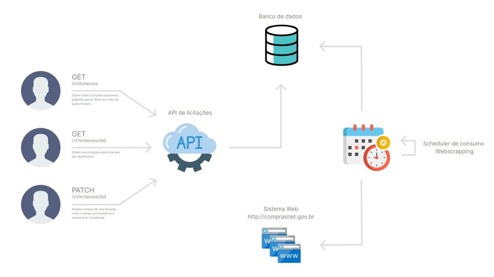

<h1  align="center">API de Licitações</h1>  

Este projeto consiste em uma aplicação de web scraping desenvolvida em Java, com o objetivo de coletar informações sobre licitações publicadas no Diário Oficial da União. A aplicação conta com um agendamento configurável para executar periodicamente a lógica necessária para a extração de dados e a persistência no banco de dados. A API em si possui um método de consulta paginada para buscar todas as licitações armazenadas no banco, permitindo também a aplicação de filtros com base em determinados dados. Além disso, existe a possibilidade de atualizar uma licitação, marcando-a como lida ou não lida.

**Site de onde os dados foram obtidos:** http://comprasnet.gov.br/ConsultaLicitacoes/ConsLicitacaoDia.asp 

### Tecnologias utilizadas :hammer_and_wrench:

- Java 11
- Spring Boot 2.7.12
- Spring Data JPA
- MySQL;
- Jsoup

### Diagrama da aplicação



### Como rodar o projeto :arrow_forward:

1. No terminal de sua preferência clone o projeto:
```
>git clone https://github.com/jhemysbarros/licitacoes-api.git
```
2. Acessando Banco de Dados MySQL

Rode o comando abaixo para inicializar o banco de dados:
```
>docker-compose up -d mysql 
```

3. Abra a IDE de sua preferênciaque comporte Spring e suba o projeto:

> Aqui foi utilizado o **IntelliJ IDEA**
>
>**Outras ferramentas**: Spring Tool Suite, VS Code

4. Abra o Swagger para ter acesso ao contrato da API
 ```
>http://localhost:8080/swagger-ui/index.html#/ 
```